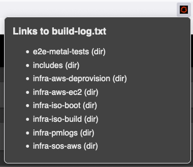

# Prow CI Helper (web extension)

Small popup providing quick links to job's build-log.txt files.



## Installation

### Firefox

Available for Firefox: https://addons.mozilla.org/addon/prow-ci-helper/

### Chromium based browsers

To use in Chromium based browsers:
1. Clone this repository
2. Copy `manifest-chrome.json` to `manifest.json`:
   ```sh
   cp manifest-chrome.json manifest.json
   ```
3. Navigate to `chrome://extensions/`
4. Enable "Developer Mode" (toggle in upper right corner)
5. Use "Load unpacked" button and select cloned repository's directory.

## Usage

1. Navigate to an OpenShift CI Prow Job results ([example](https://prow.ci.openshift.org/view/gs/test-platform-results/logs/periodic-ci-openshift-microshift-release-4.19-periodics-e2e-aws-tests-bootc-nightly/1907976660582404096))
1. Click on the extension's icon :
   1. Firefox: icon is part of the address bar
   1. Chrome: icon resides together with other extension icons
